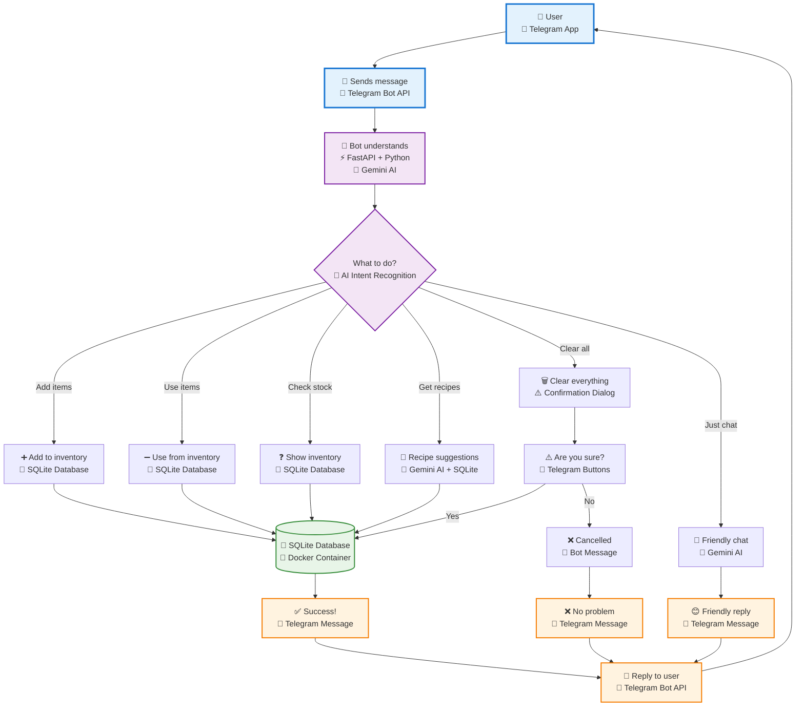
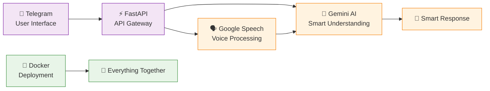

# 🤖 Telegram Groceries AI Bot

> **Smart Kitchen Inventory Management with AI-Powered Conversations**

A Telegram bot that helps you manage your kitchen inventory through natural conversation. Add items by voice or text, scan receipts with AI vision, get recipe suggestions, and never forget what's in your kitchen again!

## 📱 Features

- **�️ Voice & Text Input**: "Beli 2kg ayam" or voice messages
- **📸 Receipt Scanning**: Take photos of receipts, AI extracts items
- **🧠 Smart Understanding**: Recognizes Indonesian slang and units
- **🍳 Recipe Suggestions**: AI suggests recipes based on your inventory
- **🔄 Ingredient Normalization**: "ayam" = "chicken", smart matching
- **⚠️ Safe Operations**: Confirmation dialogs for important actions
- **📊 Complete Logging**: Track all inventory changes

## 🛠️ Tech Stack

- **Backend**: FastAPI + Python Telegram Bot
- **AI**: Google Gemini AI (Vision + Text)
- **Voice**: Google Speech-to-Text API
- **Database**: SQLite
- **Deployment**: Docker + Docker Compose

## 🚀 Quick Deployment

### Prerequisites

- Docker & Docker Compose installed
- Telegram Bot Token
- Google Cloud API credentials
- Gemini AI API key

### 1. Clone Repository

```bash
git clone <your-repo-url>
cd groceriesAI
```

### 2. Environment Setup

Create `.env` file:

```bash
# Telegram Bot
TELEGRAM_BOT_TOKEN=your_telegram_bot_token_here
WEBHOOK_URL=https://your-domain.com/webhook

# Google APIs
GEMINI_API_KEY=your_gemini_api_key_here
GOOGLE_APPLICATION_CREDENTIALS=/app/training-telkom.json

# Optional
LOG_LEVEL=INFO
```

### 3. Add Credentials

Place your Google Speech API credentials file:
```bash
# Add your service account JSON file
cp your-credentials.json training-telkom.json
```

### 4. Deploy with Docker

```bash
# Build and start all services
docker-compose up -d

# Check logs
docker-compose logs -f

# Stop services
docker-compose down
```

## 🔧 Development Setup

### Local Development

```bash
# Create virtual environment
python -m venv venv
source venv/bin/activate  # Linux/Mac
# or
venv\Scripts\activate  # Windows

# Install dependencies
pip install -r requirements.txt

# Run locally
python main.py
```

### Environment Variables for Development

```bash
export TELEGRAM_BOT_TOKEN="your_token"
export GEMINI_API_KEY="your_key"
export GOOGLE_APPLICATION_CREDENTIALS="training-telkom.json"
export LOG_LEVEL="DEBUG"
```

## 📋 API Setup Guide

### 1. Telegram Bot Token

1. Message [@BotFather](https://t.me/botfather) on Telegram
2. Create new bot: `/newbot`
3. Choose bot name and username
4. Copy the token from BotFather

### 2. Google Cloud Setup

#### A. Enable APIs
```bash
# Enable required APIs
gcloud services enable speech.googleapis.com
gcloud services enable aiplatform.googleapis.com
```

#### B. Create Service Account
```bash
# Create service account
gcloud iam service-accounts create groceries-bot \
    --description="Service account for groceries bot" \
    --display-name="Groceries Bot"

# Create and download key
gcloud iam service-accounts keys create training-telkom.json \
    --iam-account=groceries-bot@your-project.iam.gserviceaccount.com
```

#### C. Grant Permissions
```bash
# Add required roles
gcloud projects add-iam-policy-binding your-project-id \
    --member="serviceAccount:groceries-bot@your-project.iam.gserviceaccount.com" \
    --role="roles/speech.editor"
```

### 3. Gemini AI API Key

1. Go to [Google AI Studio](https://makersuite.google.com/app/apikey)
2. Create new API key
3. Copy the key to your `.env` file

## 🌐 Production Deployment

### Docker Compose (Recommended)

```yaml
# docker-compose.yml
version: '3.8'
services:
  groceries-bot:
    build: .
    ports:
      - "8000:8000"
    volumes:
      - ./data:/app/data
      - ./training-telkom.json:/app/training-telkom.json:ro
    environment:
      - TELEGRAM_BOT_TOKEN=${TELEGRAM_BOT_TOKEN}
      - GEMINI_API_KEY=${GEMINI_API_KEY}
      - WEBHOOK_URL=${WEBHOOK_URL}
    restart: unless-stopped
```

### Cloud Deployment Options

#### 🐳 Docker Hub
```bash
# Build and push
docker build -t your-username/groceries-bot .
docker push your-username/groceries-bot

# Deploy anywhere
docker run -d \
  --name groceries-bot \
  -p 8000:8000 \
  -v $(pwd)/data:/app/data \
  -v $(pwd)/training-telkom.json:/app/training-telkom.json:ro \
  --env-file .env \
  your-username/groceries-bot
```

#### ☁️ Google Cloud Run
```bash
# Deploy to Cloud Run
gcloud run deploy groceries-bot \
  --source . \
  --platform managed \
  --region asia-southeast1 \
  --allow-unauthenticated \
  --set-env-vars TELEGRAM_BOT_TOKEN=${TELEGRAM_BOT_TOKEN} \
  --set-env-vars GEMINI_API_KEY=${GEMINI_API_KEY}
```

#### 🌊 DigitalOcean App Platform
```yaml
# .do/app.yaml
name: groceries-bot
services:
- name: web
  source_dir: /
  github:
    repo: your-username/groceries-bot
    branch: main
  run_command: python main.py
  environment_slug: python
  instance_count: 1
  instance_size_slug: basic-xxs
  envs:
  - key: TELEGRAM_BOT_TOKEN
    value: ${TELEGRAM_BOT_TOKEN}
  - key: GEMINI_API_KEY
    value: ${GEMINI_API_KEY}
```

## 📊 Monitoring & Maintenance

### Health Checks

```bash
# Check bot status
curl http://localhost:8000/health

# Check logs
docker-compose logs groceries-bot

# Database status
sqlite3 data/groceries.db ".tables"
```

### Backup

```bash
# Backup database
cp data/groceries.db backup/groceries_$(date +%Y%m%d).db

# Automated backup (add to crontab)
0 2 * * * cp /path/to/data/groceries.db /path/to/backup/groceries_$(date +\%Y\%m\%d).db
```

### Updates

```bash
# Update and restart
git pull
docker-compose down
docker-compose up -d --build
```

## 🔒 Security Best Practices

### 1. Environment Variables
- Never commit `.env` files
- Use secrets management in production
- Rotate API keys regularly

### 2. Network Security
```bash
# Use HTTPS in production
WEBHOOK_URL=https://your-domain.com/webhook

# Consider using reverse proxy (nginx)
# Configure firewall rules
# Use Docker secrets for sensitive data
```

### 3. Database Security
```bash
# Regular backups
# Encrypt sensitive data
# Monitor access logs
# Use database passwords in production
```

## 🐛 Troubleshooting

### Common Issues

#### Bot Not Responding
```bash
# Check webhook
curl -X GET "https://api.telegram.org/bot${TELEGRAM_BOT_TOKEN}/getWebhookInfo"

# Reset webhook
curl -X POST "https://api.telegram.org/bot${TELEGRAM_BOT_TOKEN}/setWebhook?url=${WEBHOOK_URL}"
```

#### API Errors
```bash
# Check API quotas
# Verify credentials
# Check network connectivity
# Review error logs
```

#### Database Issues
```bash
# Check database file permissions
ls -la data/groceries.db

# Verify database integrity
sqlite3 data/groceries.db "PRAGMA integrity_check;"
```

## 📈 Performance Optimization

### Scaling Considerations

- **Horizontal Scaling**: Use load balancer with multiple instances
- **Database**: Consider PostgreSQL for high traffic
- **Caching**: Add Redis for frequently accessed data
- **CDN**: Use CDN for static assets

### Resource Limits

```yaml
# docker-compose.yml - Resource limits
services:
  groceries-bot:
    deploy:
      resources:
        limits:
          memory: 512M
          cpus: '0.5'
        reservations:
          memory: 256M
          cpus: '0.25'
```

## 🤝 Contributing

1. Fork the repository
2. Create feature branch: `git checkout -b feature/amazing-feature`
3. Commit changes: `git commit -m 'Add amazing feature'`
4. Push to branch: `git push origin feature/amazing-feature`
5. Open Pull Request

## 📄 License

This project is licensed under the MIT License - see the [LICENSE](LICENSE) file for details.

## 🆘 Support

- 📧 Email: your-email@example.com
- 💬 Telegram: @your-username
- 🐛 Issues: [GitHub Issues](https://github.com/your-username/groceries-bot/issues)

---

**🎯 Made with ❤️ for smarter kitchen management**

### 🎯 **Target Users**

- **👩‍🍳 Busy Parents** - Need quick kitchen management while juggling family
- **👨‍💼 Working Professionals** - Want efficient meal planning without hassle
- **🏠 Homemakers** - Desire better organization and less food waste
- **👩‍🎓 Students** - Need simple tools to manage limited grocery budgets
- **🧓 Elderly** - Want easy-to-use technology for daily tasks

## 🤖 How the Bot Works - User Flow + Tech Stack



## 🔄 Simple User Journey Examples

### Example 1: Adding Items
```
User: "I bought 2kg chicken and 1L milk"
↓
Bot understands: "ADD chicken(2kg), milk(1L)"
↓
Bot saves to database
↓
Bot replies: "✅ Added! You now have: Chicken: 2kg, Milk: 1L"
```

### Example 2: Getting Recipes
```
User: "What can I cook?"
↓
Bot checks what's in inventory
↓
Bot asks AI for recipe suggestions
↓
Bot replies: "🍳 You can make: Chicken Curry, Milk Rice..."
```

### Example 3: Receipt Scanning
```
User: [Sends photo of receipt]
↓
Bot scans receipt with AI vision
↓
Bot finds: "1kg rice, 500g sugar, 2L oil"
↓
Bot asks: "Add these items? ✅ Yes ❌ No"
↓
User clicks ✅
↓
Bot saves and confirms: "✅ Added 3 items to your inventory!"
```

## 🎯 Core Features Summary

| Feature | What it does | User says |
|---------|-------------|-----------|
| **➕ Add Items** | Saves food to inventory | "bought 2kg rice" |
| **➖ Use Items** | Removes food from inventory | "used 1 cup flour" |
| **❓ Check Stock** | Shows what's available | "how much rice do I have?" |
| **🍳 Get Recipes** | Suggests what to cook | "what can I make?" |
| **📸 Scan Receipt** | Reads receipt photos | [sends photo] |
| **🗑️ Clear All** | Removes everything (with confirmation) | "clear everything" |
| **💬 Chat** | Friendly conversation | "hello!" |

## � What Each Technology Does

| Component | Technology | Purpose |
|-----------|------------|---------|
| **� User Interface** | Telegram App | Where users interact with the bot |
| **📱 Message Handling** | Telegram Bot API | Receives and sends messages |
| **🤖 Bot Logic** | FastAPI + Python | Processes user requests |
| **🧠 AI Understanding** | Google Gemini AI | Understands what user wants |
| **💾 Data Storage** | SQLite Database | Stores inventory and logs |
| **🐳 Deployment** | Docker Container | Runs everything together |
| **📱 Responses** | Telegram Bot API | Sends replies back to user |

---

## 🛠️ Why We Chose These Technologies

### ⚡ **FastAPI - Modern Web Framework**
**Why FastAPI?**
- **🚀 Fast Performance**: Async support handles multiple users simultaneously
- **📚 Auto Documentation**: Automatically generates API docs for easy testing
- **✅ Type Safety**: Python type hints catch errors before deployment
- **🔌 Easy Integration**: Works seamlessly with Telegram webhooks
- **🐍 Python Native**: Leverages Python's AI/ML ecosystem

```python
# FastAPI makes webhook handling simple:
@app.post("/webhook")
async def webhook(update: Update):
    await application.process_update(update)
```

### 🗣️ **Google Speech API - Voice Recognition**
**Why Google Speech API?**
- **🎯 High Accuracy**: Industry-leading speech recognition
- **🌍 Multi-Language**: Supports Indonesian and English
- **🔊 Noise Handling**: Works well in kitchen environments
- **⚡ Real-time**: Fast processing for instant responses
- **🔗 Google Ecosystem**: Integrates well with Gemini AI

```
Voice Input: "Beli dua kilo ayam"
↓ Google Speech API ↓
Text Output: "beli dua kilo ayam"
```

### 🧠 **Gemini AI - Smart Understanding**
**Why Gemini AI?**
- **🤖 Intent Recognition**: Understands what users really want
- **🌐 Multilingual**: Handles Indonesian slang and English naturally
- **👁️ Vision Capabilities**: Can read receipt photos
- **🍳 Recipe Knowledge**: Vast cooking and ingredient database
- **🔄 Context Awareness**: Remembers conversation flow

```json
User: "beli 2kg ayam"
Gemini Response: {
  "action": "ADD",
  "items": [{"name": "ayam", "quantity": 2, "unit": "kg"}]
}
```

### 📱 **Telegram Bot - User Interface**
**Why Telegram Bot?**
- **📲 Already Installed**: Most people already have Telegram
- **💬 Natural Chat**: Feels like talking to a friend
- **🎤 Multiple Inputs**: Text, voice, photos, buttons all supported
- **🔔 Instant Notifications**: Real-time responses
- **🛡️ Secure**: End-to-end encryption available

```
Benefits:
✅ No app download needed
✅ Works on any device
✅ Push notifications
✅ Rich media support
```

### 🐳 **Docker - Easy Deployment**
**Why Docker?**
- **📦 Consistency**: "Works on my machine" → "Works everywhere"
- **🚀 Easy Scaling**: Can handle more users by adding containers
- **🔧 Environment Control**: All dependencies bundled together
- **☁️ Cloud Ready**: Deploy on any cloud platform easily
- **🔄 Easy Updates**: Update bot without server downtime

```dockerfile
# One command deploys everything:
docker-compose up -d

# Includes:
# - Python environment
# - All dependencies  
# - Database setup
# - API configurations
```

### 🎯 **Technology Synergy - Why They Work Great Together**



### 📊 **Comparison: Why Not Other Technologies?**

| Alternative | Why We Didn't Choose It |
|-------------|------------------------|
| **Flask** | Slower than FastAPI, no auto-docs, less modern |
| **Django** | Too heavy for a simple bot, unnecessary features |
| **OpenAI API** | More expensive, less multilingual support |
| **AWS Transcribe** | More complex setup, Google integrates better |
| **WhatsApp Bot** | Limited API, harder to deploy |
| **Discord Bot** | Less popular in Indonesia |
| **Native Deployment** | Harder to manage, environment issues |

### 💰 **Cost & Performance Benefits**

- **FastAPI**: Free, handles 1000+ requests/second
- **Google Speech**: Pay per use, $0.006 per 15-second audio
- **Gemini AI**: Generous free tier, then pay per request
- **Telegram**: Completely free, unlimited messages
- **Docker**: Free for small deployments

**💡 Total Cost**: Under $10/month for hundreds of users!

---

**🎯 Bottom Line:** The bot is like a smart assistant for your kitchen inventory - it understands what you say, remembers what you have, and helps you decide what to cook!
